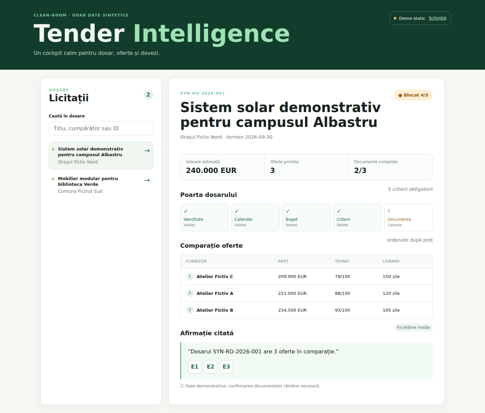

# Tender Intelligence — public edition

Tender Intelligence este un cockpit B2B pentru intelligence de achiziții publice: dashboard-ul „Azi” prioritizează următoarea acțiune, radarul de oportunități ajută la decizia GO / WATCH / NO-GO, iar fiecare procedură are un dossier cu cerințe, documente, scoruri fit/risc, oferte comparate și dovezi citabile. Produsul include și pipeline-ul propriilor depuneri, căutare în evidence base, dosare de cumpărători și companii, pattern-uri de atribuire și sănătatea datelor.

Live preview stabil: https://tender-intelligence-demo.vercel.app

## Product capabilities vs public edition

Produsul real este gândit ca un workspace cu API REST Python, SQLite + FTS pentru căutare, ingestion de documente, OCR, analiză de cerințe, analytics și dosare colaborative.

Această public edition este un build static React + TypeScript + Redux, alimentat de fixture-uri complet sintetice (`SYN-*`, nume „Exemplu/Fictiv” și `fixture://...`). Pipeline-ul persistă doar în `localStorage` browserului. Ingestion-ul live, OCR-ul, autentificarea, datele de contact, documentele reale și scrierile de rețea sunt dezactivate sau eliminate din build; pagina Sistem le afișează explicit ca limite/capabilități ale produsului. Nu pretinde că public deployment execută ingestion/OCR.

## Architecture

- Public UI: React + TypeScript + Redux Toolkit în [`frontend/App.tsx`](frontend/App.tsx), responsive desktop/mobile, Vite static mode.
- Synthetic adapter: [`frontend/demoData.ts`](frontend/demoData.ts), cu șase proceduri, document snippets, cumpărători și companii sintetice.
- Product-side Python REST/analysis: [`tender_intelligence/api.py`](tender_intelligence/api.py), [`tender_intelligence/analysis.py`](tender_intelligence/analysis.py), SQLite/fixture tooling; păstrat pentru verificări și integrarea locală unde rămâne coerent.
- Tests: Vitest + React Testing Library pentru flows de UI și Playwright pentru desktop/mobile navigation, search, dossier, evidence și pipeline persistence.

## Run locally

```sh
npm ci
VITE_DATA_MODE=static npm run build
npm run preview
```

Build-ul scrie în `static/`. Pentru dezvoltarea API-ului local, pornește separat `python3 -m tender_intelligence.api`; public preview-ul rulează static și nu face request-uri live.

Checks:

```sh
npm run check
npm test -- --run
npm run test:e2e
pytest -q
```

## Screenshots

Capturile sunt generate din build-ul production static și arată dashboard-ul real al acestei ediții:




## Data hygiene

Repository-ul public nu conține date private, contacte, documente reale, URL-uri documentare reale, buyer IDs reale sau secrete. Toate sursele vizibile folosesc schema `fixture://`. `.gitignore` este păstrat, iar CI verifică build-ul, testele, fixture-urile sintetice și auditul dependințelor.
