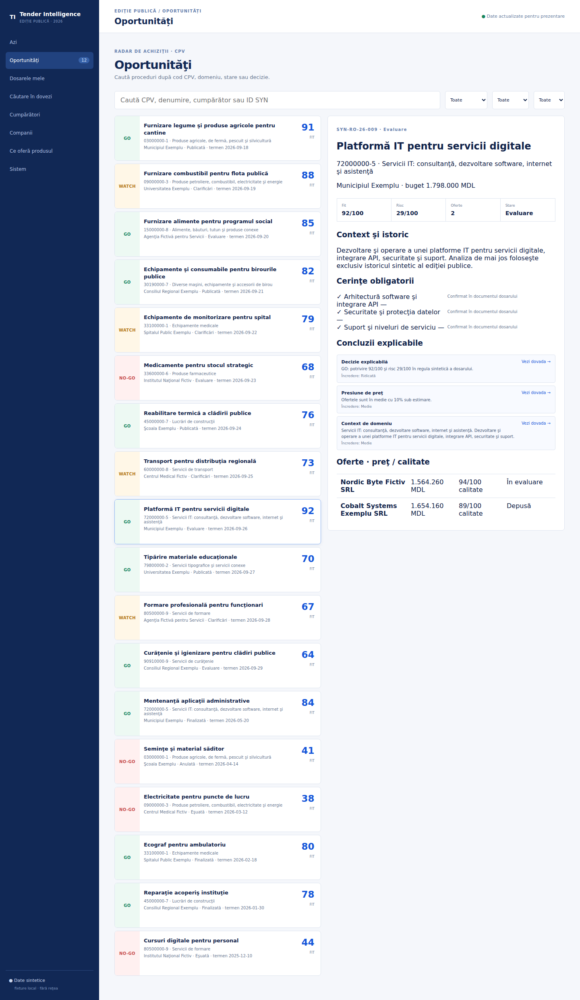

# Tender Intelligence

Tender Intelligence este un cockpit de analiză pentru furnizori care vor să găsească, să evalueze şi să pregătească mai bine proceduri de achiziţie din orice domeniu CPV.

[Deschide aplicaţia live](https://tender-intelligence-demo.vercel.app)



## Ce rezolvă

- descoperire şi filtrare multidomeniu după cod CPV, cumpărător, stare şi decizie;
- analiză documentară cu cerinţe, fragmente citate şi trasabilitate;
- prioritizare explicabilă `GO / WATCH / NO-GO` după potrivire şi risc;
- comparaţie între oferte pe preţ, calitate, livrare şi rezultat;
- dosare pentru cumpărători şi companii, cu istoric şi mix CPV;
- căutare comună în proceduri, dovezi, concluzii şi entităţi;
- pipeline de lucru pentru evaluare, pregătire şi depunere.

## Flux demonstrabil

1. Furnizorul identifică o oportunitate în radarul CPV.
2. Deschide dosarul şi verifică cerinţele, riscurile şi ofertele concurente.
3. Urmăreşte concluzia până la fragmentul care o susţine.
4. Compară istoricul cumpărătorului şi al ofertanţilor.
5. Mută procedura în pipeline-ul propriu de pregătire.

## Arhitectură şi tehnologii

- React + TypeScript pentru interfaţa cockpit;
- Redux Toolkit pentru selecţie, căutare şi sertarul de dovezi;
- Vite pentru build-ul static şi deploy;
- Python pentru adaptorul comun de date, analiză şi validarea surselor;
- Vitest + Testing Library pentru comportamentul UI;
- Playwright pentru scenarii desktop şi mobile;
- GitHub Actions pentru verificări automate.

Sursa comună [`shared/tenders.json`](shared/tenders.json) este consumată atât de interfaţă, cât şi de adaptorul Python. Astfel, codurile CPV, sumele MDL, documentele şi ofertele nu pot diverge între cele două implementări.

## Datele ediţiei publice

Ediţia publică include 12 proceduri active şi 6 proceduri istorice, distribuite în 12 domenii CPV. Companiile, cumpărătorii, ofertele, documentele şi concluziile sunt integral sintetice şi marcate `SYN`, `Fictiv` sau `Exemplu`. Codurile CPV sunt clasificatori publici reali, iar sursele locale acceptă numai schema strictă `fixture://syn-*`.

Nu sunt incluse documente, contacte, identificatori sau date comerciale reale. Pipeline-ul este păstrat local în browser. Produsul complet poate integra surse autorizate, OCR, colaborare şi persistenţă server-side.

## Verificare locală

```sh
npm ci
npm run check
npm test -- --run
PYTHONPATH=. pytest -q
npm run test:e2e
```

Scenariile E2E verifică filtrele CPV, dosarul procedurii, dovezile, pipeline-ul persistent, dosarele de entitate, istoricul, meniul mobil şi lipsa overflow-ului orizontal.
